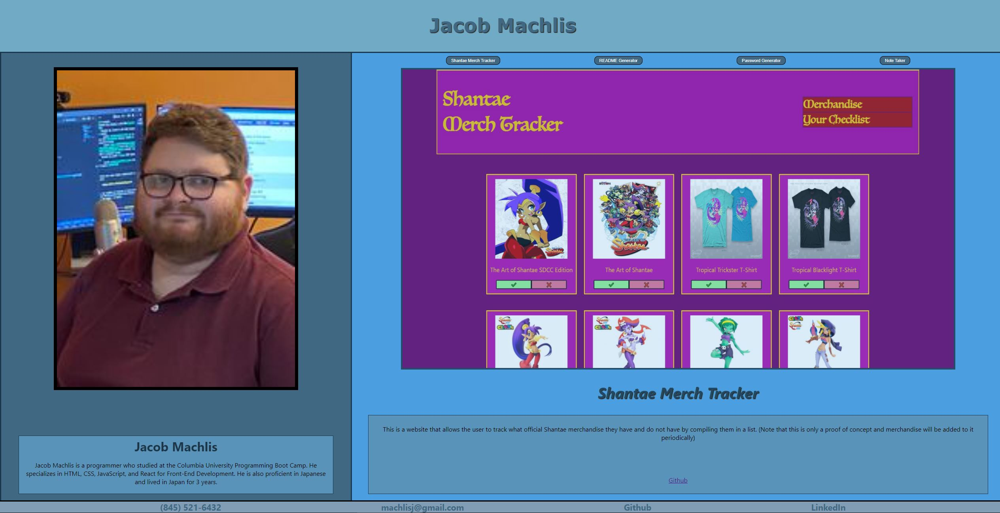
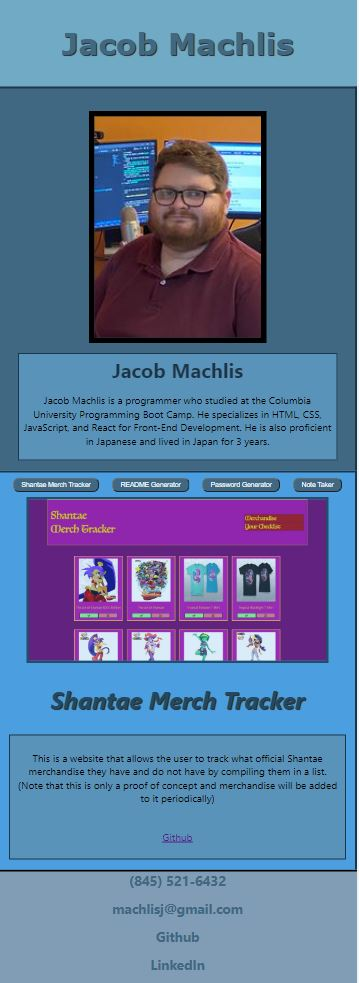

# Jacob's Portfolio

## Table of Contents

- [Description](#description)
- [Installation](#installation)
- [Usage](#usage)
- [Screenshots](#screenshots)
- [Link](#link)

## Description

This a website designed to show off and link to four projects made by Jacob Machlis as well as provide a brief description about him. The website also contains links to Jacob's contact info.

## Installation

npm i

## Usage

Click on the button of the app you want to view. To go directly to the app/site click on the picture (if applicable). If you wish to go the the Github page related to the app/site, click on the Github link below the picture.

## Screenshots

## Link

https://jacobmachlis.com
